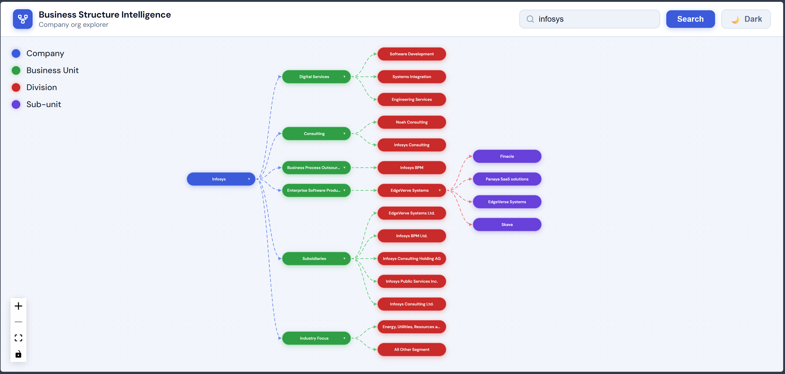

# Business Structure Intelligence (BSI)

<p align="center">
  
  
  
  
</p>

> **AI-Powered Company Organizational Structure Extraction & Visualization**

BSI researches companies from multiple data sources and uses AI to extract and visualize their organizational hierarchy as interactive tree diagrams.



---

## 🚀 Features

- **Multi-Source Research**: Aggregates data from Tavily search, Wikipedia, MoneyControl, NSE India, DuckDuckGo, and annual report PDFs
- **AI-Powered Extraction**: Uses Groq LLM (Llama 3.3) to parse research data into hierarchical business structures
- **Interactive Visualization**: React-based org chart with collapsible nodes, dark/light themes, and animated edges
- **Caching**: Redis-backed caching with in-memory fallback for performance
- **Rate Limiting**: Token bucket rate limiter to control API costs
- **Production Ready**: Docker Compose deployment with health checks

---

## 📋 Prerequisites

| Requirement | Version |
|-------------|---------|
| Python | 3.11+ |
| Node.js | 18+ |
| Redis | 7+ (optional) |
| Docker | 24+ (optional) |

---

## 🛠️ Installation

### Clone the Repository

```bash
git clone https://github.com/YOUR_USERNAME/business-structure-ai.git
cd business-structure-ai
```

### Backend Setup

```bash
# Navigate to backend
cd backend

# Create virtual environment
python -m venv venv
source venv/bin/activate  # Linux/Mac
# OR
venv\Scripts\activate     # Windows

# Install dependencies
pip install -r requirements.txt

# Copy environment template
cp .env.example .env
```

### Frontend Setup

```bash
# Navigate to frontend
cd frontend

# Install dependencies (using pnpm)
pnpm install

# OR using npm
npm install
```

---

## ⚙️ Configuration

### Environment Variables

Create a `.env` file in the `backend/` directory:

```env
# API Keys (Required)
GROQ_API_KEY=your_groq_api_key
TAVILY_API_KEY=your_tavily_api_key

# Redis Configuration (Optional)
REDIS_HOST=localhost
REDIS_PORT=6379
REDIS_DB=0
REDIS_PASSWORD=
REDIS_PREFIX=bsi:
CACHE_TTL=3600

# Rate Limiting
RATE_LIMIT_PER_MINUTE=60
RATE_LIMIT_PER_HOUR=1000
MAX_API_CALLS_PER_REQUEST=20

# CORS
ALLOWED_ORIGINS=http://localhost:3000

# Environment
ENVIRONMENT=development
```

### Getting API Keys

| Service | How to Get | Free Tier |
|---------|------------|-----------|
| **Groq** | [groq.com](https://groq.com) | 60 req/min |
| **Tavily** | [tavily.com](https://tavily.com) | 1000 queries/month |

---

## 🎯 Usage

### Running Locally

#### Backend

```bash
cd backend
uvicorn api:app --reload --host 0.0.0.0 --port 8000
```

The API will be available at `http://localhost:8000`

- API Documentation: `http://localhost:8000/docs`
- Health Check: `http://localhost:8000/health`

#### Frontend

```bash
cd frontend
npm start
```

The frontend will open at `http://localhost:3000`

### Running with Docker

```bash
# Start all services
docker-compose up -d

# View logs
docker-compose logs -f

# Stop services
docker-compose down
```

Services:
- **API**: `http://localhost:8000`
- **Redis**: `localhost:6379`
- **Frontend**: `http://localhost:3000`

---

## 📖 API Reference

### Endpoints

| Method | Endpoint | Description |
|--------|----------|-------------|
| `GET` | `/` | API information |
| `GET` | `/health` | Health check with stats |
| `GET` | `/company/{name}` | Legacy endpoint |
| `GET` | `/company/{name}/intelligence` | Get company structure |

### Example Request

```bash
curl http://localhost:8000/company/Apple/intelligence
```

### Response

```json
{
  "success": true,
  "company": "Apple",
  "structure": {
    "name": "Apple",
    "children": [
      {
        "name": "Software & Services",
        "children": [
          {"name": "iOS"},
          {"name": "macOS"},
          {"name": "iCloud"}
        ]
      },
      {
        "name": "Hardware Products",
        "children": [
          {"name": "iPhone"},
          {"name": "iPad"},
          {"name": "Mac"}
        ]
      }
    ]
  }
}
```

---

## 🏗️ Architecture

```
┌─────────────┐    ┌──────────────┐    ┌────────────────┐
│   Frontend  │───▶│   FastAPI    │───▶│   LangGraph    │
│  (React)    │◀───│   Backend    │◀───│   Workflow     │
└─────────────┘    └──────────────┘    └────────────────┘
                                               │
                    ┌─────────────────────────┼────────────────────────────┐
                    ▼                         ▼                            ▼
            ┌──────────────┐          ┌──────────────┐           ┌──────────────┐
            │  Research    │          │  Structure   │           │ Intelligence │
            │  Agent       │          │  Agent        │           │  Agent       │
            └──────────────┘          └──────────────┘           └──────────────┘
                    │                         │                            
                    ▼                         ▼                           
            ┌──────────────────────────────────────────────────────────────┐
            │  Data Sources: Tavily, Wikipedia, MoneyControl, NSE, PDF   │
            └──────────────────────────────────────────────────────────────┘
```

### Key Components

| Component | Description |
|-----------|-------------|
| `api.py` | FastAPI application with endpoints, validation, error handling |
| `workflow.py` | LangGraph state machine for research → extract pipeline |
| `research_agent.py` | Multi-source data collection (Tavily, Wikipedia, NSE, etc.) |
| `structure_agent.py` | AI-powered structure extraction using Groq LLM |
| `scrapers/registry.py` | Pluggable scraper registry pattern |
| `utils/cache.py` | Redis + in-memory fallback caching |
| `utils/rate_limiter.py` | Token bucket rate limiter |

---

## 🧪 Testing

### Run Backend Tests

```bash
cd backend
pytest -v
```

### Run Specific Test Files

```bash
pytest tests/test_api.py -v
pytest tests/test_agents.py -v
pytest tests/test_validation.py -v
```

### Coverage Report

```bash
pytest --cov=backend --cov-report=html
```

---

## 📁 Project Structure

```
business-structure-ai/
├── backend/
│   ├── api.py                 # FastAPI application
│   ├── workflow.py             # LangGraph orchestration
│   ├── requirements.txt        # Python dependencies
│   ├── docker-compose.yml     # Docker services
│   ├── agents/
│   │   ├── research_agent.py  # Multi-source research
│   │   ├── structure_agent.py # AI extraction
│   │   └── ...
│   ├── scrapers/
│   │   ├── registry.py        # Scraper registry
│   │   ├── wikipedia.py       # Wikipedia scraper
│   │   ├── nse.py             # NSE India scraper
│   │   └── ...
│   ├── utils/
│   │   ├── cache.py           # Redis caching
│   │   ├── rate_limiter.py    # Rate limiting
│   │   └── logger.py          # Logging
│   └── tests/
│       ├── test_api.py
│       ├── test_agents.py
│       └── ...
├── frontend/
│   ├── src/
│   │   ├── App.js            # React app with ReactFlow
│   │   ├── index.js          # Entry point
│   │   └── ...
│   ├── package.json
│   └── public/
├── docs/                      # Documentation
├── .gitignore
└── README.md
```

---

## 🔧 Development

### Adding New Scrapers

1. Create a new scraper class extending `BaseScraper`:

```python
# scrapers/new_source.py
from scrapers.base import BaseScraper

class NewSourceScraper(BaseScraper):
    name = "new_source"
    enabled = True
    
    def scrape(self, company: str) -> str:
        # Implement scraping logic
        return scraped_content
```

2. Register in `scrapers/registry.py`:

```python
from scrapers.new_source import NewSourceScraper
registry.register(NewSourceScraper())
```

### Adding New LLM Models

Edit `MODELS` list in `backend/agents/structure_agent.py`:

```python
MODELS = [
    "llama-3.3-70b-versatile",
    "llama-3.1-8b-instant",  # Add new model here
    "mixtral-8x7b-32768",
]
```

---

## 🚨 Known Issues

1. **API Keys Required**: Both `GROQ_API_KEY` and `TAVILY_API_KEY` must be configured
2. **India-Centric**: NSE and MoneyControl scrapers are India-specific
3. **Rate Limits**: External APIs have rate limits; the rate limiter helps but may throttle requests

---

## 🤝 Contributing

1. Fork the repository
2. Create a feature branch (`git checkout -b feature/amazing-feature`)
3. Commit your changes (`git commit -m 'Add amazing feature'`)
4. Push to the branch (`git push origin feature/amazing-feature`)
5. Open a Pull Request

---

## 📄 License

This project is licensed under the MIT License - see the [LICENSE](LICENSE) file for details.

---

## 🙏 Acknowledgments

- [LangGraph](https://langchain-ai.github.io/langgraph/) - Workflow orchestration
- [Groq](https://groq.com/) - LLM inference
- [Tavily](https://tavily.com/) - Search API
- [ReactFlow](https://reactflow.dev/) - Interactive node graphs

---

## 📞 Support

- Open an issue for bugs or feature requests
- Check the [documentation](docs/) for detailed guides
- Review the [API docs](http://localhost:8000/docs) when running locally
